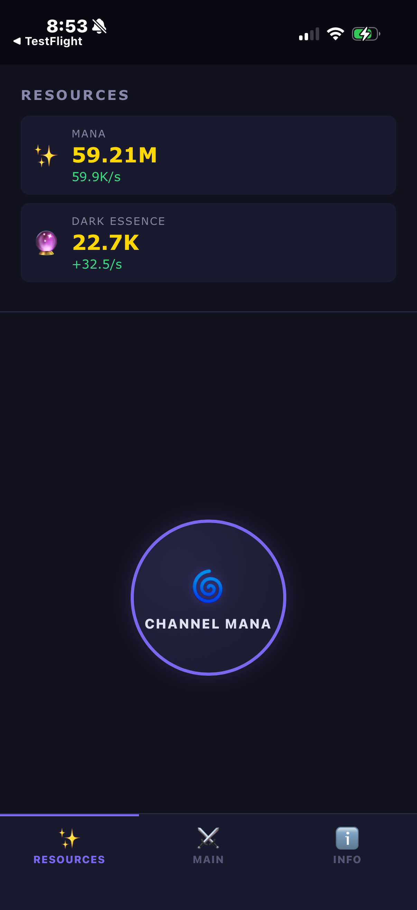
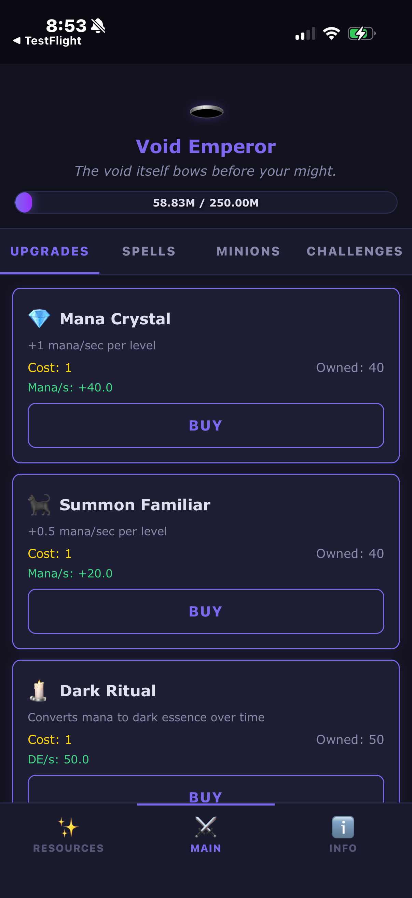
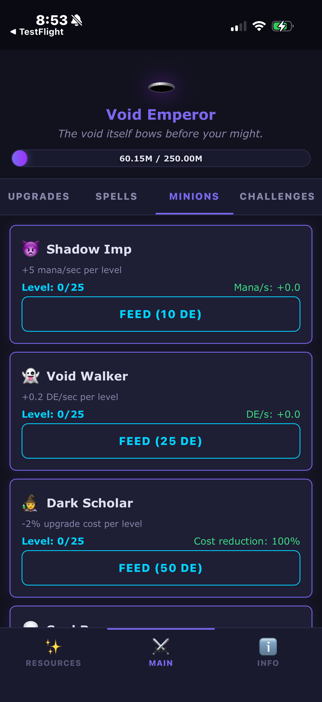
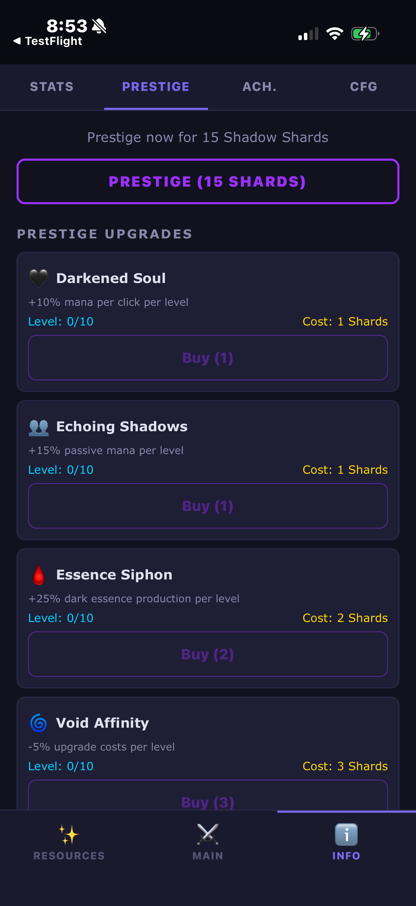

# Dark Ascension — Support

This is the public support repository for **Dark Ascension**, an idle/incremental dark fantasy game for iOS and Windows.

  
  
  
  

## Links

- **[Report a Bug or Request a Feature](https://github.com/mikejamescalvert/Dark-Ascension-Support/issues)**
- **[Privacy Policy](https://mikejamescalvert.github.io/Dark-Ascension-Support/)**
- **[Windows Download](https://github.com/mikejamescalvert/Dark-Ascension/releases/latest)**

## What is Dark Ascension?

Dark Ascension is an idle/incremental game where you channel mana, unlock dark upgrades, prestige through shadow realms, and transcend into the void. Features include:

- 9 upgrades, 5 spells, 4 minions, 5 challenges, 8 artifacts
- Prestige and Transcendence dual-layer reset systems
- 25 achievements, 12 stages of progression
- Responsive UI for mobile and desktop
- Offline progress up to 8+ hours
- No ads, no tracking, no data collection

## Screenshots

| View | Screenshot |
|------|-----------|
| Resources & Channel Mana | [resources](screenshots/02-resources.png) |
| Upgrades Tab | [upgrades](screenshots/01-upgrades.png) |
| Minions Tab | [minions](screenshots/03-minions.png) |
| Stats & Lore | [stats](screenshots/04-stats.png) |
| Prestige System | [prestige](screenshots/05-prestige.png) |
| Achievements | [achievements](screenshots/06-achievements.png) |

## App Store Teaser Images

Marketing screenshots sized for App Store submission:

| Screen | 6.7" iPhone | 6.5" iPhone |
|--------|------------|------------|
| Resources | [6.7"](teasers/02-resources_6.7in.png) | [6.5"](teasers/02-resources_6.5in.png) |
| Upgrades | [6.7"](teasers/01-upgrades_6.7in.png) | [6.5"](teasers/01-upgrades_6.5in.png) |
| Minions | [6.7"](teasers/03-minions_6.7in.png) | [6.5"](teasers/03-minions_6.5in.png) |
| Stats | [6.7"](teasers/04-stats_6.7in.png) | [6.5"](teasers/04-stats_6.5in.png) |
| Prestige | [6.7"](teasers/05-prestige_6.7in.png) | [6.5"](teasers/05-prestige_6.5in.png) |
| Achievements | [6.7"](teasers/06-achievements_6.7in.png) | [6.5"](teasers/06-achievements_6.5in.png) |

## Privacy

Dark Ascension collects **zero** data. No analytics, no tracking, no network calls. All game saves are stored locally on your device. Read the full [Privacy Policy](https://mikejamescalvert.github.io/Dark-Ascension-Support/).

## Contact

Open an [issue](https://github.com/mikejamescalvert/Dark-Ascension-Support/issues) for bug reports, feature requests, or questions.
