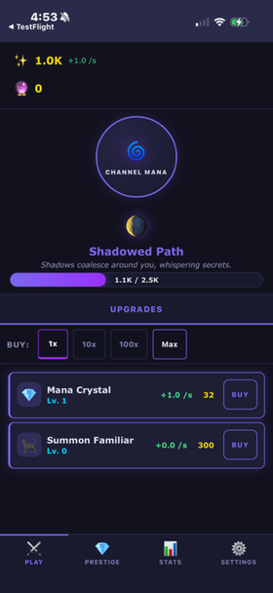
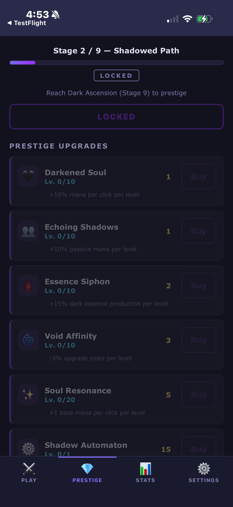
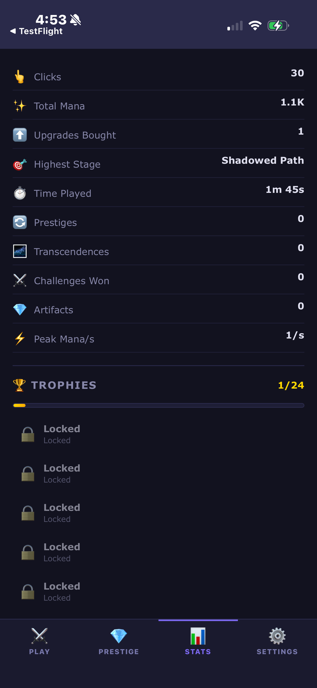
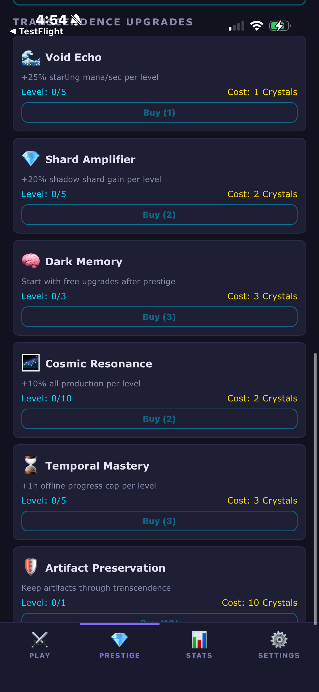

# Dark Ascension — Support

This is the public support repository for **Dark Ascension**, an idle/incremental dark fantasy game for iOS and Windows.

  
  
  
  

## Links

- **[Report a Bug or Request a Feature](https://github.com/mikejamescalvert/Dark-Ascension-Support/issues)**
- **[Privacy Policy](https://mikejamescalvert.github.io/Dark-Ascension-Support/)**
- **[Windows Download](https://github.com/mikejamescalvert/Dark-Ascension/releases/latest)**

## What is Dark Ascension?

Dark Ascension is an idle/incremental game where you channel mana, unlock dark upgrades, prestige through shadow realms, and transcend into the void. Features include:

- 9 upgrades with auto-buyer automation, 7 spells with auto-caster, 6 minions
- 6 upgrade synergy combos and 3 artifact sets with set bonuses
- 8 artifacts with 4 rarity tiers, enhancement, and rerolling
- 5 challenges with permanent upgrade rewards
- Prestige and Transcendence dual-layer reset systems
- 25 achievements, 12 stages of progression
- Full automation system (auto-buyers, auto-caster, auto-prestige)
- Responsive UI for mobile and desktop
- Offline progress up to 8+ hours
- No ads, no tracking, no data collection

## Screenshots

| View | Screenshot |
|------|-----------|
| Main Game & Upgrades | [main-game](screenshots/01-main-game.png) |
| Prestige & Shadow Automaton | [prestige](screenshots/02-prestige.png) |
| Stats & Trophies | [stats](screenshots/03-stats-trophies.png) |
| Settings | [settings](screenshots/04-settings.png) |
| Transcendence Upgrades | [transcendence](screenshots/05-transcendence.png) |

## Privacy

Dark Ascension collects **zero** data. No analytics, no tracking, no network calls. All game saves are stored locally on your device. Read the full [Privacy Policy](https://mikejamescalvert.github.io/Dark-Ascension-Support/).

## Contact

Open an [issue](https://github.com/mikejamescalvert/Dark-Ascension-Support/issues) for bug reports, feature requests, or questions.
